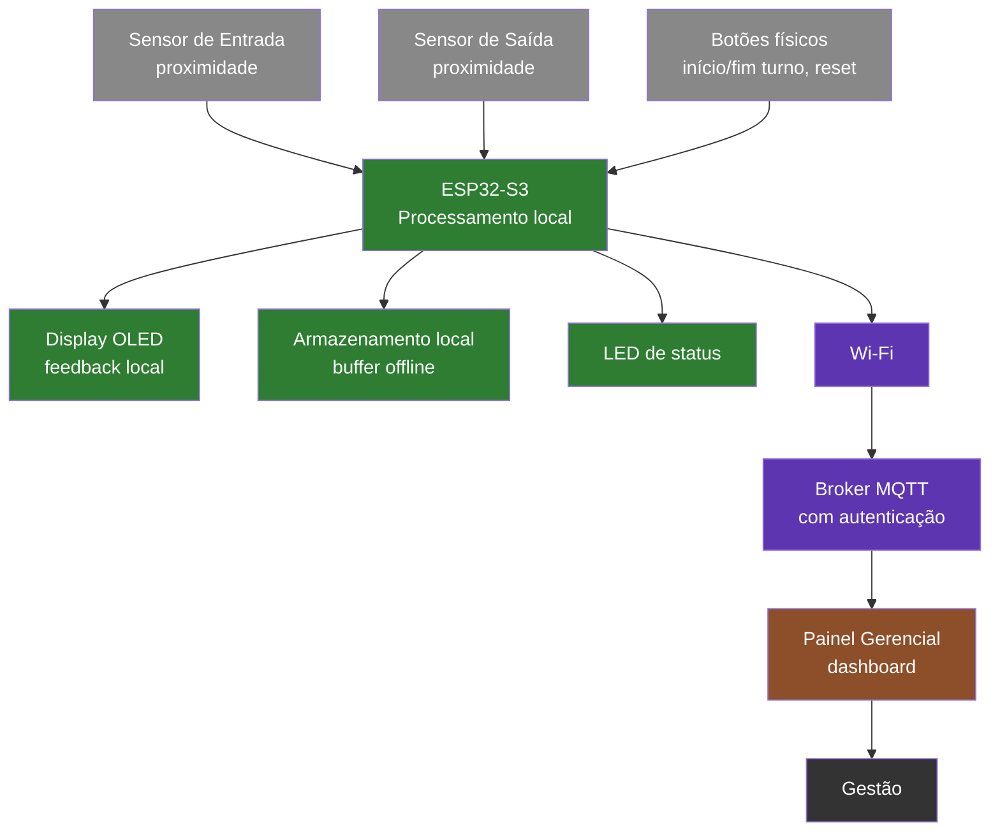

# Projeto i++ — Sistema IoT para Contagem e Monitoramento da Produção

> **Equipe:** Os Pnaatos.
> **Integrantes:**  Emily Fernanda, João Isaac, Paula Hânnia, Vitória Maciel.
> **Cenário:** 6 — Contagem automatizada de produtos e gestão de dados no ambiente industrial.

## 1. O que é este projeto (Visão Geral)

Em estações de trabalho manuais, operadores precisam interromper sua atividade
periodicamente para registrar a produção em planilhas, o que consome tempo
produtivo, gera erros de contagem e atrasa a visibilidade da gestão sobre o
ritmo real da linha (Cenário 6).

Para resolver isso, propomos um Sistema IoT para automatizar a contagem de
peças produzidas em estações de trabalho manuais, eliminando o apontamento
manual em planilhas e disponibilizando o ritmo de produção em tempo real para
a gestão. Cada estação possui sensores de proximidade e um nó de
processamento local (ESP32-S3), que mantém a contagem funcionando mesmo
durante indisponibilidade de rede.

O sistema detecta a chegada e a saída de peças na bancada, calcula o ritmo de
produção, identifica microparadas e envia os dados via MQTT para um painel
gerencial, sem depender de intervenção manual do operador para o registro.

## 2. Diagrama de Blocos

**Legenda dos elementos:**
- **Sensores de entrada/saída** (cinza) — camada de sensoriamento; detectam a passagem física da peça na bancada.
- **Botões físicos** (cinza) — entrada de eventos de turno (início, fim, reset manual protegido).
- **ESP32-S3** (verde) — camada de processamento local; roda o firmware, faz debounce, contagem, cálculo de ritmo de produção e detecção de microparadas.
- **Display OLED / LED de status** (verde) — saída local, feedback imediato ao operador sobre produção, ritmo e estado da conexão.
- **Armazenamento local** (verde) — buffer offline que garante 0% de perda de eventos mesmo sem rede disponível.
- **Wi-Fi / Broker MQTT** (roxo) — camada de conectividade; transmite eventos e resumos periódicos para o painel, com reenvio de backlog após reconexão.
- **Painel Gerencial** (terracota) — camada de software; consolida os dados de todas as estações para a gestão.

## 3. Dependências e Stack previstas

### Hardware
- ESP32-S3
- Sensor infravermelho de proximidade E18-D80NK
- Display OLED 0,96" (controlador SSD1306, interface I2C)
- Botões físicos (início/fim de turno e reset manual)
- LED de status
- Fonte de alimentação 5V

### Software / Firmware
- Linguagem: **C**
- Framework: **ESP-IDF** (Espressif IoT Development Framework)
- Ambiente de desenvolvimento: **Visual Studio Code** com a extensão oficial **ESP-IDF** (Espressif Systems)
- Componentes/bibliotecas previstos — **a definir**

### Infraestrutura
- Broker MQTT com autenticação — **a definir**
- Painel Web — **(tecnologia/framework a definir)**

## 4. Pré-requisitos (a detalhar)

- [ ] Visual Studio Code instalado
- [ ] Extensão ESP-IDF instalada e configurada no VS Code
- [ ] Toolchain do ESP-IDF configurada (via instalador da própria extensão)
- [ ] Broker MQTT configurado e acessível na rede de testes

## 5. Como rodar (a detalhar nas próximas entregas)
